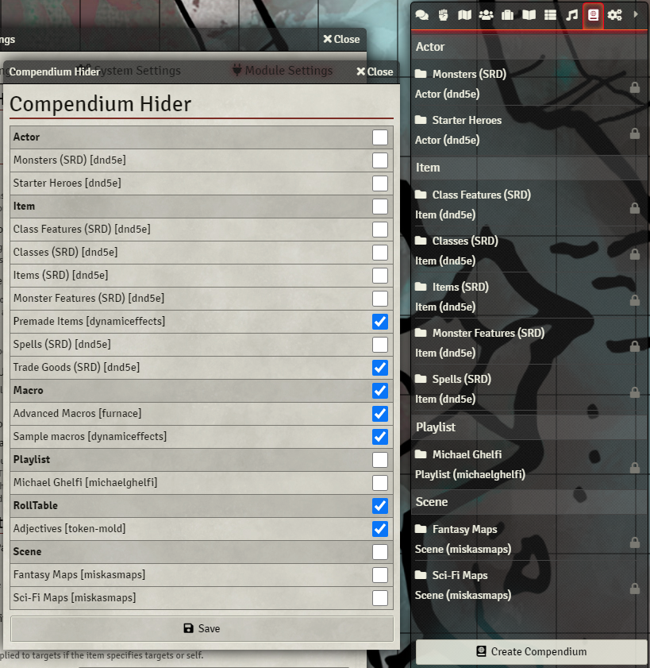

# Compendium Hider

This is a small module for FoundryVTT that allows you to hide compendiums you are not using.

To use this module, open the module settings and tick the compendiums you wish to hide

This module has taken a lot of inspiration from the Custom CSS module, by Toon324.

## Future

1. Hiding tabs when all compendiums inside are hidden
2. ???
